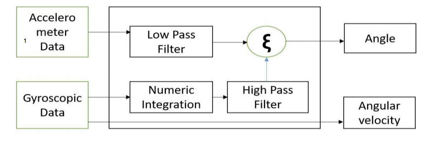
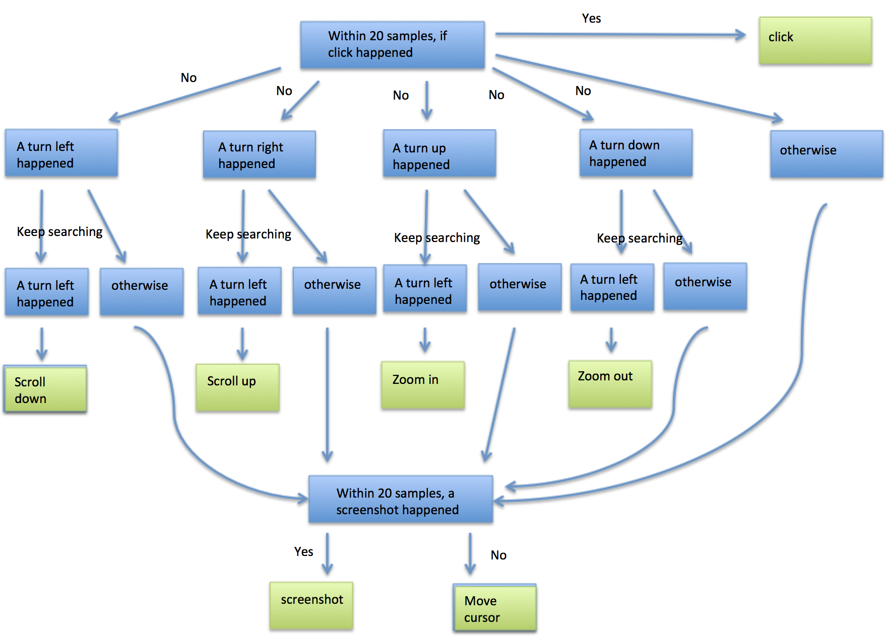
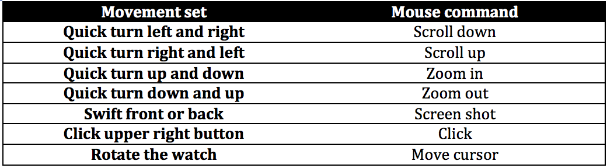

# ECE202A Final Project  
### Group Member: Shuping Chen, Lu Fan
Control the mouse cursor movement with smartwatch.
## Introduction 
In this project we are going to use the on board accelerometer and gyroscope to measure the movement of Hexiwear and hence make more decision about the command made to the mouse.
## Problem Statement 
For this project, the problem contains 4 major parts. The first part is to build a regression model using the sensor data that controls the movement of mouse cursor. The second part is build a classifier that classify a movement to a certain predefined movement sets that maps to a certain command to mouse. The third part is to send the command over the BLE link in a timely manner. The fourth part is to operative the system in real time.
## Prior Works  
A group of student in Cornell University a wireless computer pointing device with accelerometer based movement control.  
[Glove Mouse](http://people.ece.cornell.edu/land/courses/ece4760/FinalProjects/f2012/as986_hl525/as986_hl525/index.htm)  
  
## Technical Approaches
### Configure sensor and draw samples.
First, we need to configure the sensors to operate at the maximum rate in order to get best estimate of the current position and orientation of the Hexiwear. The maximum output data rate is set to be 800Hz for both accelerometer and gyroscope. We set the sensor output data rate at 800Hz for both of the sensors using the library provided by Hexiwear site.

|| 
|:--:| 
|*Figure 1. Example register map[1]*|   

||
|:--:| 
|*Figure 2. Output data rate[1]*|   

The next mission is to process the data, the data we measure is linear acceleration and angular velocity, but the actual data we want is position and orientation in world reference frame. In order to doing this, we implement a complementary filter to get the data we desired. 
The accelerometer measures the acceleration due to gravity and other forces. if we want to use the accelerometer to get the accurate linear acceleration, we have to eliminate the influence due to gravity. And that means we need to get the accurate measurement of object’s orientation. To do so, we have to filter out the short-term force applied.
On the other hand, gyroscope can get the accurate instant velocity data but the measurement is subject to some constant drift, so we have to apply a high pass filter to filter out the drift.  

||
|:--:| 
|*Figure 3. Complementary filter block diagram[2]*|      

The complementary filter adds a low pass filter to accelerometer data and a high pass filter to gyroscope data and combines those two to get a better measurement of  the object orientation.

After this we tried to collect data for out motion sets via a serial link in maximum speed. First option we tried is to using the Hexiwear control the mouse cursor as a conventional mouse (using the position in a plane to map the cursor position). This method ends up failed and then other method is implemented (detail in next chapter).     
The sensor data is more capable to measure the orientation than measure the linear velocity of the object. The situation is much worse if we use BLE as communication method (due to the delay of the system). We finally choose the using the orientation as the variable to build a regression model to control the mouse cursor. The model is simply a linear model as the displacement of the move cursor is proportional to the rotation angle of the Hexiwear around x and y axis.  
### Decision Tree and classifier
The system have to handle some more complicated movement in order to give command other than move the cursor. From our experimental regression model, we figured that the Hexiwear is more capable of measure the angular velocity/position than measure the linear velocity/position, so we are going to design the command using more angular data. 
First, we decide using angular orientation to control the mouse cursor. The relative position that the mouse moving to is proportional to the row and pitch angle of the Hexiwear. This way, we have a relative accurate control about move the cursor. 
Then, for the onetime, more complicate command. we have to design it that is easy to distinguish between normal move cursor. After some trail, we decided to build a window of about 20 samples, then from that window try to find a predefined motion start and stop, otherwise, give the move cursor command. The decision tree is described in the graph below. 


|| 
|:--:|
|*Figure 4. Decision tree*| 

And to get the motion start and motion stop, we implemented several linear binary SVM classifier that give a set of sensor data classify if that define a motion start or stop. To train that classifier, we draw samples from user motion and label the desired motion start or stop. 
       
||
|:--:| 
|*Figure 5.Command table*|     

### BLE communication in Raspberry pi side
Pair with Hexiwear by command line (MAC address can be known through scan or BLE APP in phone)      
```bash
bluetoothctl
pair MAC_ADDRESS
```     
Exit from bluetoothctl after pairing

Use bluepy package and the main functions are listed below    
Connect Raspberry pi with Hexiwear through python script (read_data.py)  
```python
dev = btle.Peripheral("MAC_ADDRESS")
```     
Get the services from Hexiwear through its UUID  
```python
s = dev.getServiceByUUID("UUID")
```    
Read the data from that service
```python
c = s.getCharacteristics()[0]   
data = c.read()
```
### BLE communication in Hexiwear side
Toggle Hexiwear BLE (its default is in advertisement mode)   
```cpp
kw40z_device.ToggleAdvertisementMode();
```
Send instruction, move_x and move_y to Raspberry pi   
```cpp
kw40z_device.SendAccel(instruction, move_x, move_y);
```

### Memory Queue and Multithread
To prevent interference between BLE transmission and sensor data processing, we use multithread in the OS, one thread is handle the BLE transmission and other thread handle get sensor data and process the data. To share memory between those two threads, we implement memory queue to do this. The data thread process data and push command into memory queue and on the event have new data on the queue, the BLE thread take data from memory queue and send the packet to RaspberryPi. 
The challenge is to make the time that data thread generates a new command roughly equal to the time that BLE send one packet. That’s the limitation for the system latency and accuracy. 

## Experimental Methods
### Regression trail
We first tried to implement a regression model using the linear velocity that enable the Hexiwear works exactly same as the conventional mouse. The challenge for this mission is to collect sensor data that match the movement of actual mouse. During our experiment, we have to bind the docking station to my waist while operating a normal mouse.  Then we using the normal mouse to draw a certain picture and log the mouse location and sensor data. For sync mouse log and data log, we log mouse location when we receive new sensor data from serial link. 
Using that data set to build a regression model. Here are some experimental result.   
#### Linear SVM    

||
|:--:|   
|*Figure 6. Result for linear SVM model*|  

#### Neuron network

|| 
|:--:|  
|*Figure 7. Result for neural network model*|

The model trained by linear SVM is not useable to get the result we want. The neural network implementation is much better but is cannot implemented in Mbed system. And it also maybe overfitting due to the nature of the neural network, on the hardware test, its also fail to produce desired result. At this point, we decide not using the linear displacement but using the angular displacement to build the control model of the mouse cursor.    

### Increase BLE speed in raspberry pi trail
We tried the following command to change the minimum connection interval in Raspberry pi side, but did not see any differences.  
```bash
echo 6 > /sys/kernel/debug/bluetooth/hci0/conn_min_interval
```   
### Increase BLE speed in Hexiwear trail 
We used threading for the dataThread, which is a thread samples and generate instruction as seen in main_queue.cpp. In order to share data between main and dataThread, we used queue in Mbed. However, since BLE takes more time, the system would not operate as fast as the serial one. Below is part of code for using queue in Mbed. 
```cpp
message_t *message = mpool.alloc();
message->cmd = cmd;
queue.put(message);
```
```cpp
osEvent evt = queue.get();
if (evt.status == osEventMessage) {
  message_t *message = (message_t*) evt.value.p;
  cmd = message->cmd;
  mpool.free(message);
```
## Analysis and Results
Our system can achieve all designed commands. Both the serial version and BLE version can move the cursor in the right direction. also can do the designed scroll, zoom, screenshot and click. 
The BLE version has more latency than the serial version, there is about 250ms latency in the BLE version, and due to the internal time the takes to communicate with BLE the accuracy of catch the scrool,zoom or screenshot command will also decrease (due to the time interval that need to deal with BLE) below are the demo link for both version. 
### YouTube links
[Controlling mouse cursor Bluetooth version](https://youtu.be/LPZd3f0x7rw)     
[Controlling mouse cursor serial version](https://youtu.be/ypCX5zBp9ks)   
## Future Directions
### Improve BLE speed
For our project , the maximum frequency that the BLE can send a packet is about 200ms, which is kind slow due to the nature of the application.  We explore the ways that can make BLE link transmit data more frequently but not able to find a way by the deadline. We have tried the serial connected version which has better user experience.  The faster the BLE link can send the packet, the better the user experience is. One way to try is dig into the kw40z firmware and change some of this maybe to speed things up. 
### Better decision making
Other direction is to further optimize the decision making process, in our system is still a chance of misclassification. We can explore the possibility of more complicated classfier for complicated motion detection. 

## References  
[1] FXOS8700CQ 6-axis sensor with integrated linear accelerometer and magnetometer data sheet
[https://aip.scitation.org/doi/pdf/10.1063/1.5018520](https://aip.scitation.org/doi/pdf/10.1063/1.5018520)      
[2] Comparison of complementary and Kalman filter based data fusion for attitude heading reference system      
[https://aip.scitation.org/doi/pdf/10.1063/1.5018520](https://aip.scitation.org/doi/pdf/10.1063/1.5018520)
  
[bluepy - a Bluetooth LE interface for Python](https://ianharvey.github.io/bluepy-doc/)    
[Hexi_Accelero_Magneto_Example](https://os.mbed.com/teams/Hexiwear/code/Hexi_Accelero_Magneto_Example/)        
[Hexi_Gyro_Example](https://os.mbed.com/teams/Hexiwear/code/Hexi_Gyro_Example/)   
[Hexiwear_BLE_Example](https://os.mbed.com/teams/Hexiwear/code/Hexi_BLE_Example/)   
[Pyautogui](https://pyautogui.readthedocs.io/en/latest/index.html)   
[Raspberry Pi Zero W and Hexiwear Bluetooth Experiment](https://github.com/Klamath233/ecexxx/blob/master/docs/btle.md)   
[RTOS Mbed](https://os.mbed.com/handbook/RTOS)   
[Tutorial: BLE Pairing the Raspberry Pi 3 Model B with Hexiwear](https://mcuoneclipse.com/2016/12/19/tutorial-ble-pairing-the-raspberry-pi-3-model-b-with-hexiwear/)    
